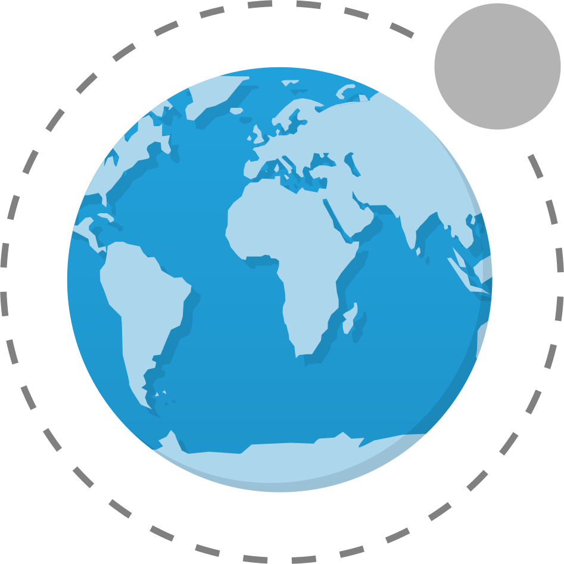

v<p align="right"><a href="README.pt_BR.md">Português</a></p>

<h1 align="center">
   
   <br />
   Lua WPP | <a href="https://github.com/natanael-b/lua-wpp/archive/refs/heads/framework.zip">Download</a>
</h1>

<p align="center"><i>"A cool way to create Web Apps and static pages"</i></p>

<p align="center">
   <a href="https://github.com/natanael-b/lua-wpp/fork">
     
   </a>
   
   
  
</p>

A small but powerful Lua Framework to create Web Apps and static pages, using a much cleaner `Lua WPP` syntax will make you forget about HTML the classic Hello world goes from:

```HTML
<!doctype html>
<html>
   <head>
     <meta charset="utf8" />
     <title>Demo</title>
     <meta content="width=device-width,initial-scale=1.0" name="viewport" />
   </head>
   <body>
     <h1>Hello world</h1>
   </body>
</html>
```

For:

```moon
html {
   head {
     title 'Demo'
   };
   body {
     h1 'Hello world'
   }
}
```

With zero cost of abstraction since the final page will be pure HTML

# How to install?

With a Lua interpreter installed and configured on your computer, add `lua-wpp`:

1. Click <a href="https://github.com/natanael-b/lua-wpp/archive/refs/heads/framework.zip">download</a>
2. Extract the contents of the `zip` to some folder

Just like that, installation is as simple as downloading and extracting a `zip` file :)

# How to use?

In the folder you extracted:

1. Create a file for example `Project.lua` containing:

```moon
Language = "pt_BR" -- Defines the default language for pages

Pages = {
   sources = "lua",
   output="www",

   'index'
}

require "lua4webapps-framework"
```

Now create a folder called "lua" and in it an `index.lua` file with the content:

```moon
html {
   head {
     title 'Demo'
   };
   body {
     h1 {
       style = "padding:9pt; background-color: #3498db; color: #ecf0f1";
       'Hello World'
     } * 7
   }
}
```

By running `lua5.4 Project.lua` you will have a page built on `www` with the name "index.html" where the text `Hello world` will appear 7 times with a purple background and white lettering

# Resources

Cleaner syntax alone is not enough, `Lua WPP` brings other key features ([see documentation for more details](DOCUMENTATION.md)):

### Zero dependencies

Having no dependencies, any supported standard Lua interpreter is capable of making `Lua WPP` work

### Minification

Generates minified HTML code reduces the size of the final project

### Event code autoseparation

Separating code from event properties (`onclick` for example) makes maintenance easier (if needed) on rendered pages

### Magic Operators

##### Repetition

```moon
p 'This text will appear 5x' * 5
```

##### Interleaving

```moon
hello {
   li ^ {'Item 1','Item 2','Item 3','Item 4'}
}
```

### Interaction with 2D tables

Automatic translate 2D tables into HTML tables:

```moon
table {
   {'A1', 'B1', 'C1'},
   {'A2', 'B2', 'C2'},
   {'A3', 'B3', 'C3'},
}
```


### Reusable components

One of the most powerful features of `Lua WPP` allows you to create components:e:

```moon
card = div:extends {
   -- We can add properties
   style = 'box-shadow: 0 4px 8px 0 rgba(0,0,0,0.2); max-width:320px;',
   -- And also childrens
   childrens = {
     -- In first field is the elements before in use childrens
     first = {
        {
           -- Define the tag and optional properties and childrens
           element = img {
              style="width:100%"
           },
           -- We can bind the properties 
           bindings = {
              ['src'] = 'picture',
           }
        },
        {
           element = div:extends {
              style='padding: 2px 16px;',
              childrens = {
                 first = {
                    {
                       element = h4,
                       bindings = {
                          [1] = 'title'
                       }
                    },
                    {
                       element = p,
                       bindings = {
                          [1] = 'description'
                       }
                    },
                 }
              }
           },
           bindings = {
              ['title'] = 'title',
              ['description'] = 'description',
           }
        },
     }
   }
}
```

Using:

```lua
html {
   head {
     title 'Demo'
   },
   body {
     card {
       picture = "https://www.w3schools.com/howto/img_avatar.png",
       title="John Doe",
       description = "Architect & Engineer"
     },
     card {
       picture = "https://www.w3schools.com/howto/img_avatar2.png",
       title="Jane Doe",
       description = "Interior Designer"
     },
   }
}
```

In addition, it is enough to change the component once for all to be changed, code reuse in HTML!
